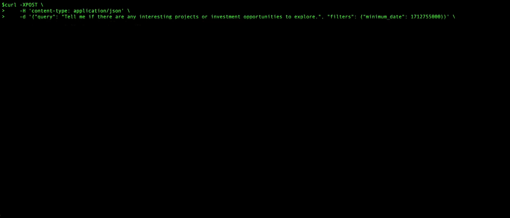

# AI-powered research assistant

Q&A application capable of answering market research questions using GPT-4 powered semantic search of a self-hosted vector database (ChromaDB). Implemented using an event-driven and containerized architecture, with infrastructure defined using AWS CDK.

# Architecture

# Instructions

Coming soon!